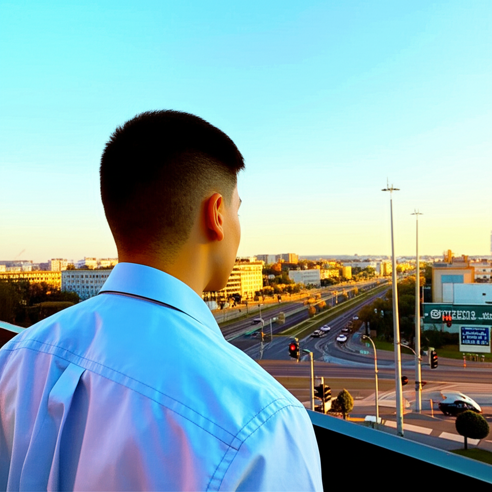

# 🖼 AI-Driven Image Generator using Google GenAI
AI-Driven Image Generator is a simple and intuitive web application built using Streamlit and Google GenAI (Gemini 2.0). It allows users to input any creative text prompt and instantly generate a unique image along with optional text content. This project showcases the power of multi-modal generative AI by combining text understanding and image creation.

Whether you're an artist, developer, or curious user, this app provides a hands-on way to explore how AI can transform your imagination into visual content.
Whether you're an artist, developer, or curious user, this app provides a hands-on way to explore how AI can transform your imagination into visual content.

## 🚀 Features

- ✍️ Accepts user text input (prompts)
- 🖼️ Generates images and textual content using Gemini 2.0 model
- ⬇ Allows downloading generated images
- ✅ Interactive and responsive UI built with Streamlit
- 🌗 Light/Dark theme toggle for better viewing experience
##  📸 Demo



---
## ⚙️ Setup Instructions

1.Create and activate a virtual environment (optional but recommended)
python -m venv venv

source venv/bin/activate  # On Windows: venv\Scripts\activate

2.Install the dependencies

pip install -r requirements.txt

Run the Streamlit app

streamlit run image_generator.py

## 📁 Files Included

```
├── image_gener.py         # Main Streamlit application script
├── req.txt           # Python dependencies needed to run the app
└── gemini-native-image.png    # Sample output (auto-generated image)
```

---

## 🔑 API Key

⚠ You must provide your own Google GenAI API key to run this app.

Replace the placeholder API key in the code:

client = genai.Client(api_key="YOUR_API_KEY_HERE")
